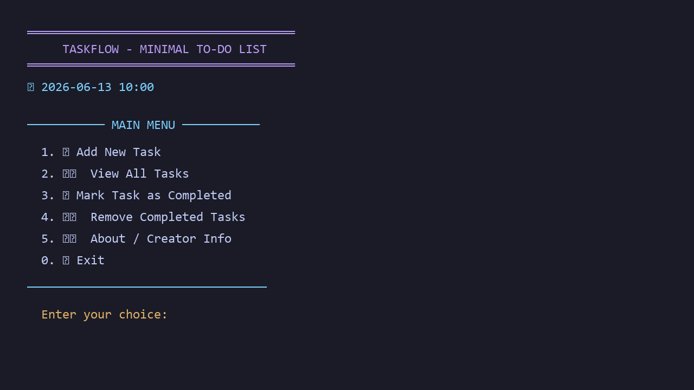
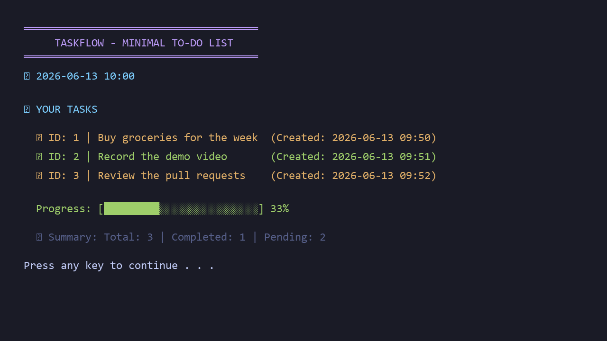

# TaskFlow — Console To-Do List (C++)

**A colorful terminal to-do manager** for adding tasks, marking them complete, tracking progress, and clearing finished items.

<p align="center">
  
  
</p>

---

## Overview

TaskFlow is a menu-driven console application built with C++ and the STL. It stores tasks in memory with timestamps and uses ANSI colors (and Windows console APIs where needed) for a readable terminal experience.

## Screenshots

<p align="center">
  
  
</p>

## Features

- Add new tasks with automatic timestamps
- View all tasks in a formatted list
- Mark tasks as completed
- Remove completed tasks in bulk
- **Progress bar** for completion ratio
- Colored console UI on **Windows** and **Linux**

## Quick start

```bash
g++ -std=c++17 -o taskflow "To-Do List Application.cpp" && ./taskflow
```

**Windows:**

```powershell
g++ -std=c++17 -o taskflow.exe "To-Do List Application.cpp"
.\taskflow.exe
```

## Built with

- **C++17**
- **STL** — `vector`, `string`, `algorithm`
- **ANSI colors** / Windows Console API

## Project structure

```
To-Do-List-Application/
├── To-Do List Application.cpp
└── README.md
```

## Author

**Shahab Ahmed** — [GitHub](https://github.com/ShahabAhmed01) · [LinkedIn](https://www.linkedin.com/in/shahabahmed01/) · [Portfolio](https://shahabahmed01.github.io)

## License

Open source for learning and portfolio use.
